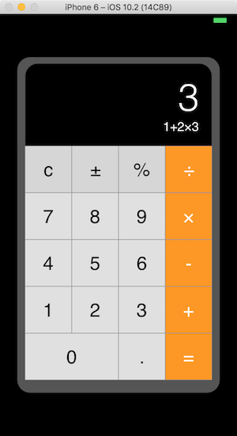
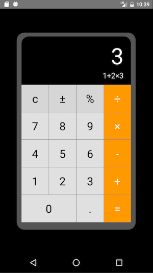

# React-Native Simple Calculator

A simple calculator created with React-Native for iOS and Android with the following features:

- iOS & Android Apps based on [React-Native](https://facebook.github.io/react-native).
- State management with [Mobx](https://mobx.js.org).
- Stateless functional component for calculator view.
- Display infix notation.
- Convert infix to postfix to evaluate.

### iOS & Android

